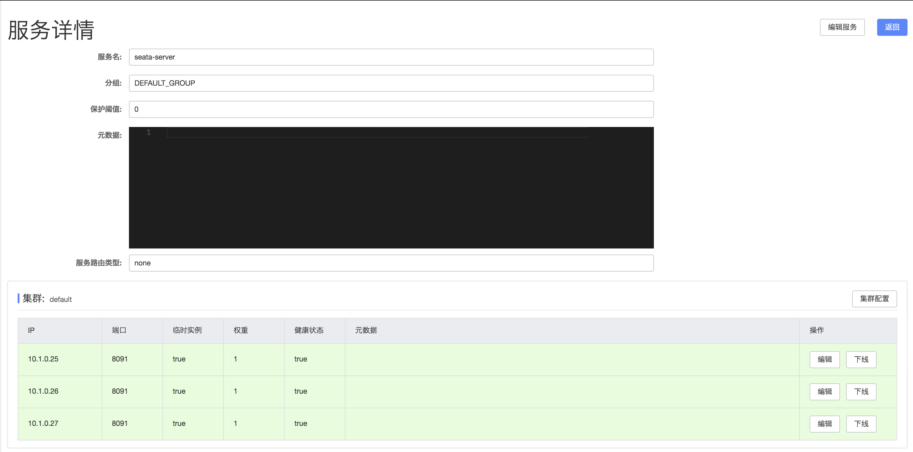
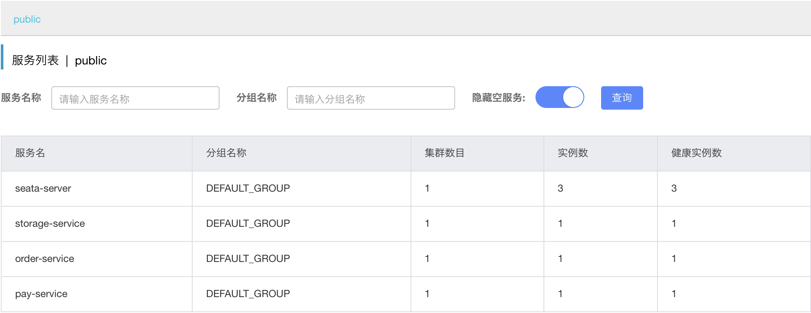
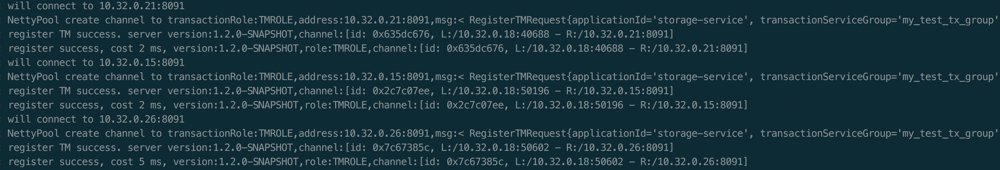
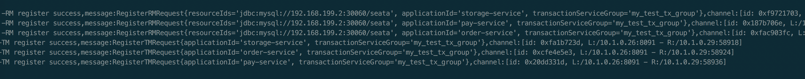
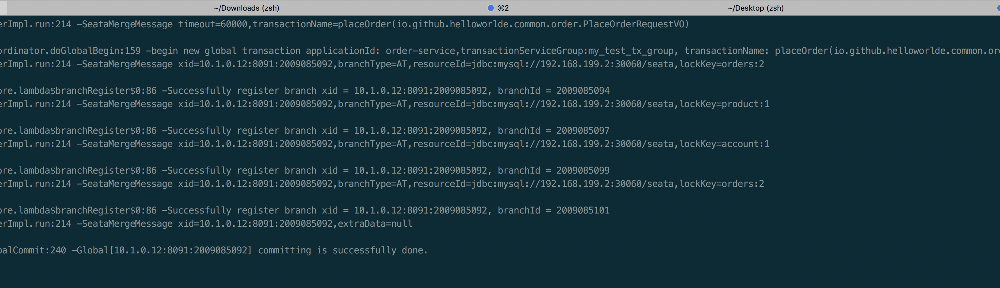
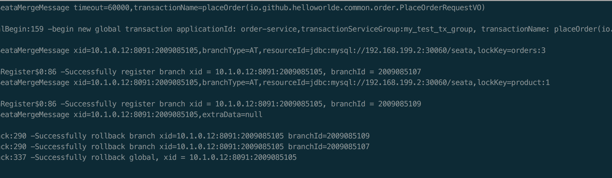
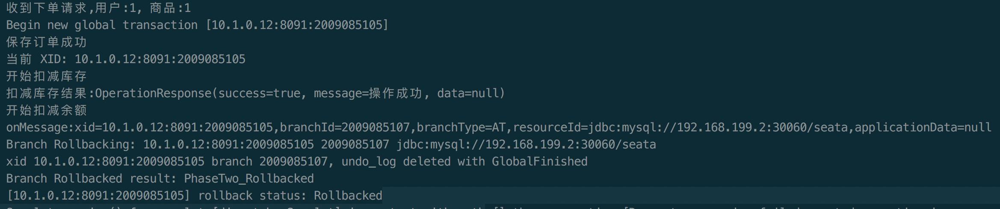

# Seata 高可用部署实践
使用配置中心和数据库来实现 Seata 的高可用，以 Nacos 和 MySQL 为例，将[seata-alibaba-demo](https://github.com/solvaysphere/seata-alibaba-demo)应用部署到 Kubernetes 集群中

该应用使用 Nacos 作为配置和注册中心，总共有四个服务: seata-business-service, seata-order-service, seata-account-service, seata-order-service, 其中 seata-business-service 对外提供下单接口，当余额和库存充足时，下单成功，会提交事务，当不足时会抛出异常，下单失败，回滚事务

## 准备工作

需要准备可用的注册中心、配置中心 Nacos 和 MySQL，通常情况下，注册中心、配置中心和数据库都是已有的，不需要特别配置，在这个实践中，为了简单，只部署单机的注册中心、配置中心和数据库，假设他们是可靠的

* Docker 部署 MySQL
部署一台MySQL 数据库，用于保存事务数据，服务器地址为 192.168.199.2
```shell
docker run --name mysql -p 30060:3306-e MYSQL_ROOT_PASSWORD=123456 -d mysql:5.7.17
```
* Docker部署 Nacos
在服务器部署 Nacos，开放 8848 端口，用于 seata-server 注册，服务器地址为 192.168.199.2
```shell
docker run --name nacos -p 8848:8848 -e MODE=standalone nacos/nacos-server
```
* K8S部署 Nacos
在K8S集群服务器部署 Nacos
```shell
cd doc/nacos-k8s-cluster
kubectl apply -f nacos-server-ingress.yaml
```

## 部署 seata-server
* 创建seata-server需要的表
具体的 SQL 参考 [script/server/db](https://github.com/seata/seata/tree/develop/script/server/db)，这里使用的是 MySQL 的脚本，数据库名称为 seata

同时，也需要创建 undo_log 表， 可以参考 [script/client/at/db/](https://github.com/seata/seata/blob/develop/script/client/at/db/)

* 修改seata-server配置
将以下配置添加到 Nacos 配置中心，具体添加方法可以参考 [script/config-center](https://github.com/seata/seata/tree/develop/script/config-center)
```properties
service.vgroupMapping.my_test_tx_group=default
service.vgroupMapping.seata-order-service-group=default
service.vgroupMapping.seata-account-service-group=default
service.vgroupMapping.seata-storage-service-group=default
service.vgroupMapping.seata-business-service-group=default
store.mode=db
store.db.datasource=druid
store.db.dbType=mysql
store.db.driverClassName=com.mysql.jdbc.Driver
store.db.url=jdbc:mysql://134.134.2.70:3306/seata?useUnicode=true&rewriteBatchedStatements=true
store.db.user=root
store.db.password=123456
```

### 部署 seata-server 到 Kubernetes
* seata-server.yaml
需要将 ConfigMap 的注册中心和配置中心地址改成相应的地址
```yaml
apiVersion: v1
kind: Service
metadata:
  name: seata-ha-server
  namespace: default
  labels:
    k8s-app: seata-ha-server
spec:
  type: ClusterIP
  ports:
    - port: 8091
      protocol: TCP
      name: http
  selector:
    k8s-app: seata-ha-server

---

apiVersion: apps/v1
kind: StatefulSet
metadata:
  name: seata-ha-server
  namespace: default
  labels:
    k8s-app: seata-ha-server
spec:
  serviceName: seata-ha-server
  replicas: 3
  selector:
    matchLabels:
      k8s-app: seata-ha-server
  template:
    metadata:
      labels:
        k8s-app: seata-ha-server
    spec:
      containers:
        - name: seata-ha-server
          image: docker.io/seataio/seata-server:1.4.2
          imagePullPolicy: IfNotPresent
          env:
            - name: SEATA_CONFIG_NAME
              value: file:/root/seata-config/registry
          ports:
            - name: http
              containerPort: 8091
              protocol: TCP
          volumeMounts:
            - name: seata-config
              mountPath: /root/seata-config
      volumes:
        - name: seata-config
          configMap:
            name: seata-ha-server-config

---
apiVersion: v1
kind: ConfigMap
metadata:
  name: seata-ha-server-config
data:
  registry.conf: |
    registry {
        type = "nacos"
        nacos {
          application = "seata-server"
          serverAddr = "nacos-headless.default.svc.cluster.local:8848"
          group = "SEATA_GROUP"
          namespace = "d81c1660-b7ff-4b6d-b92e-d27066982ce7"
          cluster = "default"
          username = "nacos"
          password = "nacos"
        }
    }
    config {
      type = "nacos"
      nacos {
        serverAddr = "nacos-headless.default.svc.cluster.local:8848"
        group = "SEATA_GROUP"
        namespace = "d81c1660-b7ff-4b6d-b92e-d27066982ce7"
        username = "nacos"
        password = "nacos"
        dataId = "seataServer.properties"
      }
    }
```

* 部署
```shell
kubectl apply -f seata-server.yaml
```
部署完成后，会有三个 pod
```shell
kubectl get pod | grep seata-ha-server

seata-ha-server-0                                1/1     Running   0          5h39m
seata-ha-server-1                                1/1     Running   0          5h39m
seata-ha-server-2                                1/1     Running   0          5h39m
```

待启动完成后，可以在 Nacos 的服务列表中发现三个 seata-server 的实例，至此，已经完成 seata-server 的高可用部署

* 查看服务日志
```shell
kubectl logs -f seata-ha-server-0
```
```shell
SLF4J: A number (17) of logging calls during the initialization phase have been intercepted and are
SLF4J: now being replayed. These are subject to the filtering rules of the underlying logging system.
SLF4J: See also http://www.slf4j.org/codes.html#replay
06:00:17.850  INFO --- [                     main] io.seata.server.Server                   : The server is running in container.
06:00:17.876  INFO --- [                     main] io.seata.config.FileConfiguration        : The file name of the operation is file:/root/seata-config/registry
06:00:17.881  INFO --- [                     main] io.seata.config.FileConfiguration        : The configuration file used is /root/seata-config/registry.conf
06:00:20.118  INFO --- [                     main] com.alibaba.druid.pool.DruidDataSource   : {dataSource-1} inited
06:00:20.675  INFO --- [                     main] i.s.core.rpc.netty.NettyServerBootstrap  : Server started, listen port: 8091
```

其中{dataSource-1}说明使用了数据库，并正常初始化完成

* 查看注册中心，此时seata-serve 这个服务会有三个实例



## 部署业务服务

* 创建业务表并初始化数据
具体的业务表可以参考 [./README_SERVICE_SQL.md](seata-alibaba-demo/README_SERVICE_SQL.md)

* 添加 Nacos 配置
在 public 的命名空间下，分别创建 data-id 为 seata-business-service.properties, seata-order-service.properties, seata-account-service.properties, seata-storage-service.properties 的配置，内容相同，需要修改数据库的地址、用户名和密码
```properties
# 数据库驱动：
spring.datasource.driver-class-name=com.mysql.cj.jdbc.Driver
# 数据源名称
spring.datasource.name=seata
# 数据库连接地址
spring.datasource.url=jdbc:mysql://134.134.2.70:3306/seata?serverTimezone=UTC
# 数据库用户名&密码：
spring.datasource.username=root
spring.datasource.password=123456

# Seata Config
seata.enabled=true
seata.application-id=${spring.application.name}
# 事务群组（可以每个应用独立取名，也可以使用相同的名字）
seata.tx-service-group=${spring.application.name}-group
# TC 集群（必须与seata-server保持一致）
seata.service.vgroup-mapping.${spring.application.name}-group=default
seata.registry.type=nacos
#seata.registry.nacos.application=seata-server
seata.registry.nacos.server-addr=${NACOS_ADDR:localhost:8848}
seata.registry.nacos.group=SEATA_GROUP
seata.registry.nacos.cluster=default
seata.registry.nacos.namespace=d81c1660-b7ff-4b6d-b92e-d27066982ce7
seata.registry.nacos.username=nacos
seata.registry.nacos.password=nacos
seata.config.type=nacos
seata.config.nacos.serverAddr=${NACOS_ADDR:localhost:8848}
seata.config.nacos.namespace=d81c1660-b7ff-4b6d-b92e-d27066982ce7
seata.config.nacos.group=SEATA_GROUP
seata.config.nacos.username=nacos
seata.config.nacos.password=nacos
```

* 项目编译打包
```shell
docker login -u username -p password

mvn clean install
cd seata-storage-service
docker build -t solvaysphere/seata-ha-storage-service:1.0.0 -f Dockerfile .
docker push solvaysphere/seata-ha-storage-service:1.0.0

cd ../
cd seata-account-service
docker build -t solvaysphere/seata-ha-account-service:1.0.0 -f Dockerfile .
docker push solvaysphere/seata-ha-account-service:1.0.0

cd ../
cd seata-order-service
docker build -t solvaysphere/seata-ha-order-service:1.0.0 -f Dockerfile .
docker push solvaysphere/seata-ha-order-service:1.0.0

cd ../
cd seata-business-service
docker build -t solvaysphere/seata-ha-business-service:1.0.0 -f Dockerfile .
docker push solvaysphere/seata-ha-business-service:1.0.0

```

* 部署服务
通过 seata-service-application.yaml 配置文件部署服务，需要注意的是修改 ConfigMap 的 NACOS_ADDR为自己的 Nacos 地址
```yaml
apiVersion: v1
kind: Service
metadata:
  namespace: default
  name: seata-ha-service
  labels:
    k8s-app: seata-ha-service
spec:
  type: NodePort
  ports:
    - port: 8104
      nodePort: 30084
      protocol: TCP
      name: http
  selector:
    k8s-app: seata-ha-service

---
apiVersion: v1
kind: ConfigMap
metadata:
  name: seata-ha-service-config
data:
  NACOS_ADDR: nacos-headless.default.svc.cluster.local:8848

---
apiVersion: v1
kind: ServiceAccount
metadata:
  name: seata-ha-account
  namespace: default

---
apiVersion: rbac.authorization.k8s.io/v1beta1
kind: ClusterRoleBinding
metadata:
  name: seata-ha-account
roleRef:
  apiGroup: rbac.authorization.k8s.io
  kind: ClusterRole
  name: cluster-admin
subjects:
  - kind: ServiceAccount
    name: seata-ha-account
    namespace: default

---
apiVersion: apps/v1
kind: Deployment
metadata:
  namespace: default
  name: seata-ha-service
  labels:
    k8s-app: seata-ha-service
spec:
  replicas: 1
  selector:
    matchLabels:
      k8s-app: seata-ha-service
  template:
    metadata:
      labels:
        k8s-app: seata-ha-service
    spec:
      serviceAccountName: seata-ha-account
      containers:
        - name: seata-ha-order-service
          image: solvaysphere/seata-ha-order-service:1.0.0
          imagePullPolicy: IfNotPresent
          env:
            - name: NACOS_ADDR
              valueFrom:
                configMapKeyRef:
                  key: NACOS_ADDR
                  name: seata-ha-service-config
          ports:
            - name: http
              containerPort: 8101
              protocol: TCP
        - name: seata-ha-account-service
          image: solvaysphere/seata-ha-account-service:1.0.0
          imagePullPolicy: IfNotPresent
          env:
            - name: NACOS_ADDR
              valueFrom:
                configMapKeyRef:
                  key: NACOS_ADDR
                  name: seata-ha-service-config
          ports:
            - name: http
              containerPort: 8102
              protocol: TCP
        - name: seata-ha-storage-service
          image: solvaysphere/seata-ha-storage-service:1.0.0
          imagePullPolicy: IfNotPresent
          env:
            - name: NACOS_ADDR
              valueFrom:
                configMapKeyRef:
                  key: NACOS_ADDR
                  name: seata-ha-service-config
          ports:
            - name: http
              containerPort: 8103
              protocol: TCP
        - name: seata-ha-business-service
            image: solvaysphere/seata-ha-business-service:1.0.0
            imagePullPolicy: IfNotPresent
            env:
              - name: NACOS_ADDR
                valueFrom:
                  configMapKeyRef:
                    key: NACOS_ADDR
                    name: seata-ha-service-config
            ports:
              - name: http
                containerPort: 8104
                protocol: TCP
```

通过以下命令，将应用部署到集群中
```shell
cd doc/seata-service
kubectl apply -f seata-service-application.yaml
```
然后查看创建的 pod，seata-ha-service 这个服务下有三个 pod
```shell
kubectl get pod | grep seata-ha-service

seata-ha-service-cfc578685-pgfwm                 4/4     Running   0          19m

```
待应用启动后，在 Nacos 的服务列表中，会有相应的服务



此时查看服务的日志，会看到服务向每一个 TC 都注册了
```shell
kubectl logs -f seata-ha-service-cfc578685-pgfwm seata-ha-business-service
```


查看任意的 TC 日志，会发现每一个服务都向 TC 注册了
```shell
kubectl logs -f seata-ha-server-0
```


## 测试
### 测试成功场景
调用下单接口，将 price 设置为 1，因为初始化的余额为 10，可以下单成功
```shell
curl -X POST \
  http://134.134.2.63:30084/business/buy \
  -H 'Content-Type: application/json' \
  -d '{
    "userId": "1",
    "amount": 100,
    "count": 10,
    "name": "水杯",
    "commodityCode": "C201901140001"
}'
```
此时返回结果为：
```shell
{
    "code": 0,
    "data": {
        "orderNo": "162da417373d49079ff74e310b88ab75",
        "userId": "1",
        "commodityCode": "C201901140001",
        "orderCount": 10,
        "orderAmount": 100
    },
    "msg": "执行成功"
}
```
查看TC 的日志，事务成功提交：



查看 order-service 服务日志 


### 测试失败场景

设置 price 为 100，此时余额不足，会下单失败抛出异常，事务会回滚
```shell
curl -X POST \
  http://192.168.199.2:30081/order/placeOrder \
  -H 'Content-Type: application/json' \
  -d '{
    "userId": 1,
    "productId": 1,
    "price": 100
}'
```
查看 TC 的日志： 


查看服务的日志 ： 


多次调用查看服务日志，发现会随机的向其中某台TC发起事务注册，当扩容或缩容后，有相应的 TC 参与或退出，证明高可用部署生效
